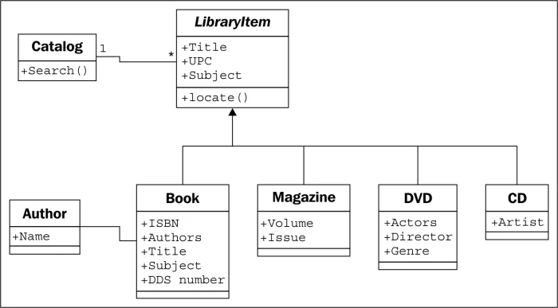
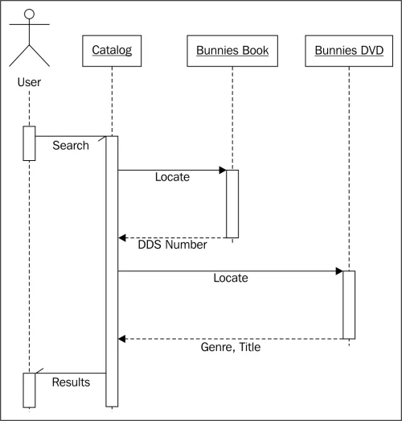

# digital-skola-project-1

## Objective
Creating Simple Librarian Search using python Object Oriented Programming

## Prerequisites
- Python ≥ 3.8 https://www.python.org/downloads/
- Visual Studio Code https://code.visualstudio.com/download
- Git https://git-scm.com/downloads
- Github https://github.com/
- SourceTree https://www.sourcetreeapp.com/

## Class Diagram

## Sequence Diagram

### References
https://subscription.packtpub.com/book/programming/9781784398781/1/ch01lvl1sec15/case-study